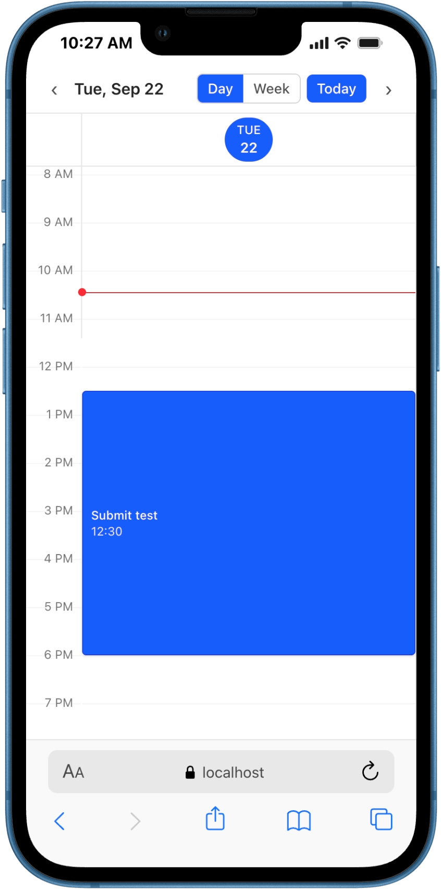
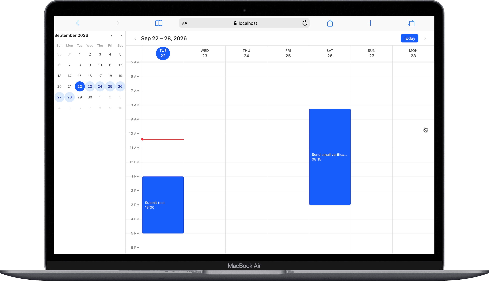

# [Softdreams Test] Time Event Calendar

A Google Calendar–style work schedule built with **React + Vite + TypeScript**,
TanStack Router, Tailwind CSS v4, and Biome. No third-party UI or calendar
libraries.

| Mobile | Desktop |
| :----: | :-----: |
|  |  |

## Features

- **7-day view port** starting from today (a real month/day calendar).
- **Events** with title, description, start and end date-time (no all-day events).
- **Drag on empty time** to draw a range and open the create dialog, prefilled.
- **Drag an event** to move it — duration preserved, snapped to the 15-minute
  grid.
- **Left-click an event** to view its details.
- **Right-click an event** for an Edit / Delete context menu.
- Overlapping events render side by side; multi-day events break across days
  with continuation chevrons.

## Stack

- React 19 + Vite (+ SWC plugin)
- @tanstack/react-router (code-based routing)
- Tailwind CSS v4 via `@tailwindcss/vite`
- TypeScript, Biome for lint/format, Vitest for tests

## Commands

```bash
pnpm install
pnpm dev          # start the dev server
pnpm build        # typecheck + production build
pnpm preview      # serve the production build
pnpm test         # vitest run
pnpm lint         # biome check
pnpm format       # biome format --write
```

## Layout

```text
softdreams-test/
├── index.html                     # Vite entry — mounts the app into <div id="root">
├── package.json                   # deps + scripts (dev/build/typecheck/test/lint/format)
├── pnpm-lock.yaml / pnpm-workspace.yaml
├── biome.json                     # lint + format settings (tabs, double quotes)
├── tsconfig.json / tsconfig.app.json / tsconfig.node.json
├── vite.config.ts                 # Vite + Tailwind v4 + Vitest
├── plan.md                        # project spec & working notes
└── src/
    ├── main.tsx                   # React root — renders <RouterProvider>
    ├── router.tsx                 # TanStack Router wiring (root → index route)
    ├── index.css                  # Tailwind v4 import + global scrollbar rules
    ├── vite-env.d.ts              # Vite client type references
    ├── routes/
    │   ├── __root.tsx             # root route, just renders <Outlet/>
    │   └── index.tsx              # the calendar page: event state, CRUD, responsive mode
    ├── components/
    │   ├── calendar/              # the week/agenda grid UI
    │   │   ├── WeekView.tsx       # grid shell: header + gutter + day columns; drag & swipe
    │   │   ├── WeekHeader.tsx     # nav (‹ Today ›), Day|Week toggle, day strip, Today-active
    │   │   ├── HourGutter.tsx     # left-hand 24h time labels (12 AM – 11 PM)
    │   │   ├── DayColumn.tsx      # one day: hour lines, events, now-line, create overlay
    │   │   ├── EventBlock.tsx     # a positioned event (title, time, continuation chevrons)
    │   │   ├── MonthCalendar.tsx  # month sidebar — click a day to pan the week
    │   │   ├── ContextMenu.tsx    # right-click Edit / Delete menu
    │   │   ├── EventDetailsDialog.tsx # read-only view with Edit + Delete
    │   │   └── EventForm.tsx      # shared create/edit form (title, description, start/end)
    │   └── commons/
    │       └── Modal.tsx          # dialog — bottom sheet on phones, centered on ≥sm
    ├── hooks/
    │   └── useMediaQuery.ts       # reactive CSS media-query hook (mobile breakpoints)
    └── lib/                       # pure, React-free logic (unit-testable)
        ├── time.ts                # date/time helpers, formatting, datetime-local parsing
        ├── week.ts                # 7-day window, week shifting, day/single-day labels
        ├── month.ts               # month grid cells + labels for the month sidebar
        ├── geometry.ts            # px↔minutes mapping, grid snapping, day segments, bounds
        ├── drag.ts                # drag-create & move-event range math (clamped to 11 PM)
        ├── layout.ts              # side-by-side layout for overlapping events
        └── events.ts              # event model + immutable CRUD + range validation
```

How the pieces fit together:

- **`src/lib/`** is the pure domain layer — pixel/time/geometry math and the event model only.
  Nothing here imports React, so every function can be tested in isolation.
- **`src/components/calendar/`** is the grid itself. `WeekView` coordinates the
  day columns and owns the pointer gestures (drag-to-create, drag-to-move, and the
  horizontal swipe that changes days on phones). `DayColumn` renders a single day's
  events via `layoutDaySegments`; `EventBlock` is the visual block.
- **`src/components/commons/`** holds reusable chrome — currently just `Modal`, which
  adapts to a bottom sheet on small screens.
- **`src/hooks/`** holds React hooks; `useMediaQuery` drives the mobile/tablet/desktop
  breakpoints (single-day below `sm`, 7-day grid from `sm`, sidebar only from `lg`).
- **`src/routes/`** is a thin state layer: it owns the week window, the focused day,
  the view mode, and all events, and wires them into `WeekView`.
